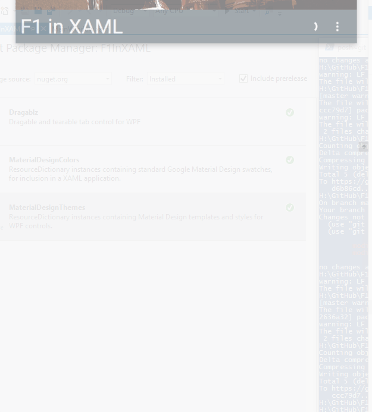

# F1 In XAML
"F1 In XAML" is a showcase application demoing [Material Design In XAML Toolkit](https://github.com/ButchersBoy/MaterialDesignInXamlToolkit).

Primarily built in conjunction with the 1.5 release of Material Design In XAML Toolkit, this demo serves to illustrate the Transitions API which is introduced in 1.5.

__Note that 1.5 is currently pre-release when installing nuget package__

Admittedly I have plenty of experience with the library - but the demo was built in less than a day, and all transitions used are out of the box, so little knowledge of WPF storyboards/animations is required.

###### [Further details below illustration](#Details)

## Running source:

* Requires Visual Studio 2015
* Clone or download source, open in Visual Studio 2015+
* Restore nuget packages
* F5
 
## Running binary:
 
 A binary is available in the GitHub Releases page.
 
## Info
 
Main Material Design In XAML GitHub Project is [here](https://github.com/ButchersBoy/MaterialDesignInXamlToolkit).

## Thanks

* Data sourced from http://ergast.com/mrd/
* Header picture sourced from http://www.f1fanatic.co.uk/ 

 
 

